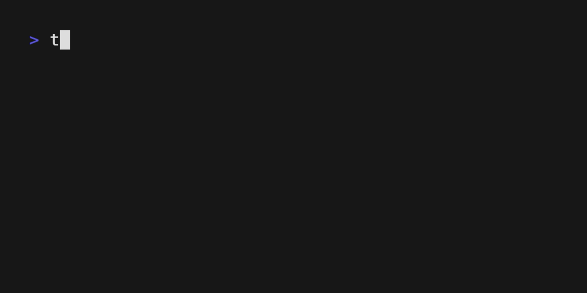

# Where is my tag

Finds the latest present tag on your git repo. A sister project from [where is my commit](https://github.com/angel-git/where-is-my-commit)

## Why this?

Tired of doing `git tag | grep v22.`:

```
v22.0.0
v22.0.0-1003.400
v22.0.0-2022119.113
v22.0.0-rc.1
v22.0.0-rc.2
v22.0.1
v22.0.10
v22.1.0-218.113
v22.1.0-505.1415
v22.1.0-rc.1
v22.1.0-rc.2
v22.1.10
v22.1.11
v22.1.12
v22.1.13
v22.1.14
v22.1.15
v22.1.16
v22.1.17
v22.1.2
v22.1.3
v22.1.4
v22.1.5
v22.1.6
v22.1.7
v22.1.8
v22.1.9
v22.2.0
....
```

and trying to figure out what was the last version released? say no more!




## Build

go build -o ./build/
